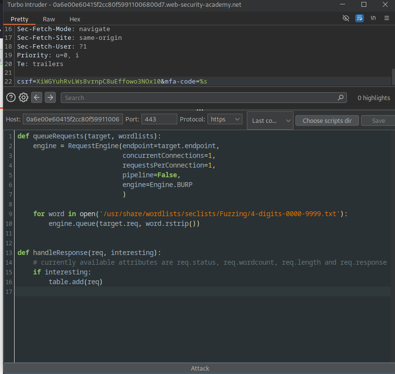

# 2FA Bypass Using Brute-Force Attack

**Difficulty:** Expert  
**Time Spent:** 4+ days  
**Completed:** January 28, 2026

---

## Objective

Exploit the vulnerability in the lab's two-factor authentication mechanism by bruteforcing the OTP code and accessing the user account.

---

## Why This Was Challenging

This challenge was very difficult because after 2 incorrectly entered OTP codes, the application redirects back to the login page. This reduces the possibility of any bruteforcing attempts since each new session generates a fresh CSRF token to monitor the user's requests.

---

## Understanding the Vulnerability

**What is 2FA Bypass via Bruteforce?**

Bypassing two-factor authentication by brute forcing the OTP code. The vulnerability exists because OTP verification attempts are not tracked per user or per OTP lifecycle, allowing unlimited verification attempts across new sessions. Although CSRF tokens and sessions are regenerated, the application fails to enforce global rate limiting or OTP attempt thresholds.

**Real-World Impact:**

This vulnerability can lead to account takeover and information disclosure. It results in unauthorized access to user accounts and lack of trust in the application's security.

---

## My Approach

### Step 1: Enumeration

First, I analyzed how the security control was implemented. After 2 wrong OTP attempts, users are required to login again with their username and password. I needed to understand how the user's requests were being tracked - which was via the CSRF token. After entering 2 incorrect OTPs, the application returns "Invalid CSRF token (session does not contain CSRF token)".

### Step 2: Creating the Macro

To bypass this token limitation, I had to generate new tokens to be appended during the bruteforce. I did this by creating a macro - a tool used to perform a sequence of actions automatically.

**The key insight:** The macro needed to mimic a real user's login flow to obtain a fresh CSRF token:

1. **GET /login** - Initial login page request (gets first CSRF token)
2. **POST /login** - Submit username and password (authenticates user)
3. **GET /login2** - Request the OTP page (generates the new CSRF token we need)

The CSRF token from step 3 is then extracted and automatically inserted into the OTP verification POST request during the bruteforce attack.

This way, each OTP attempt in Turbo Intruder gets a fresh, valid CSRF token by simulating a complete login sequence before every verification attempt.

### Step 3: Executing the Attack

I used Burp Turbo Intruder for the bruteforcing, together with the macro to obtain a new CSRF token for each attempt.

---

## Key Takeaways

- Understanding that macros must replicate the complete user interaction flow, not just grab tokens
- The usage of Turbo Intruder at first wasn't easy at all
- Gained a deeper understanding of web authentication systems and session lifecycle
- Learnt the usage of macros and session handling rules

---

## Remediation

How developers should fix this:

- Implement defense in depth by using more than one means of tracking users
- Add rate limiting and account blocking for longer durations after failed attempts
- Implement account lockout after multiple failed OTP verification attempts
- Track OTP attempts per user account, not just per session

---

## Tools Used

- Burp Suite
- Macros (Session Handling Rules)
- Turbo Intruder Extension